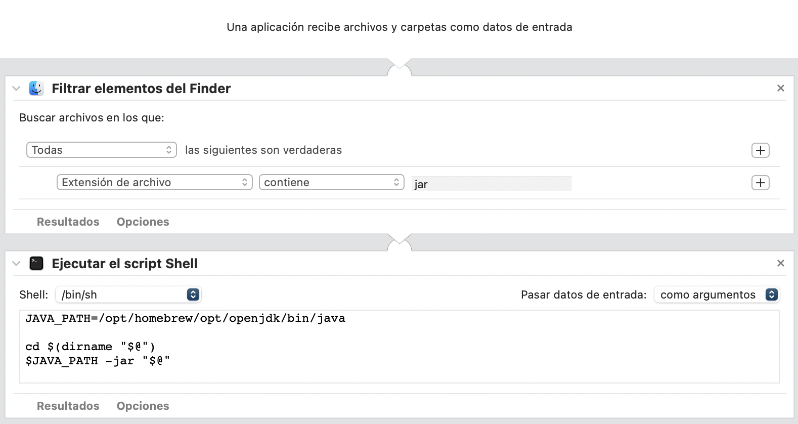

# Launcher java in Macosx

* Install `brew`:

```
/bin/bash -c "$(curl -fsSL https://raw.githubusercontent.com/Homebrew/install/HEAD/install.sh)"
```

* Install openjdk:

```
brew install openjdk
```

* Create automator app file:

<figure>
  <center>
    
  </center>
</figure>

* Save as `openLauncherJava.app` in `Applications` directory.

* Open `*.jar` file properties and set the default open app to `openLauncherJava.app`.
